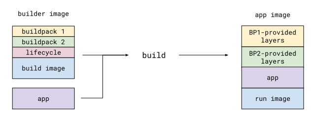
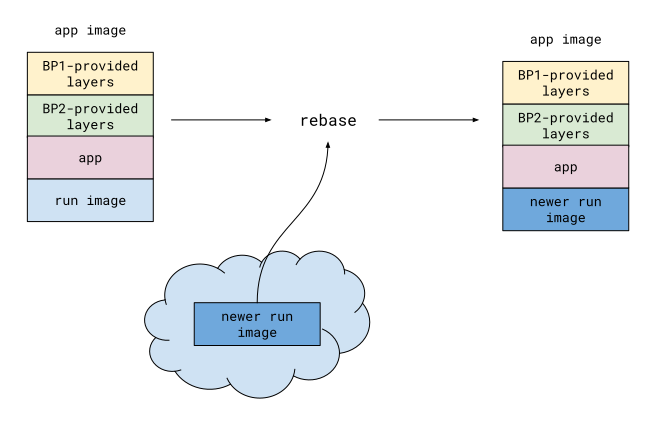
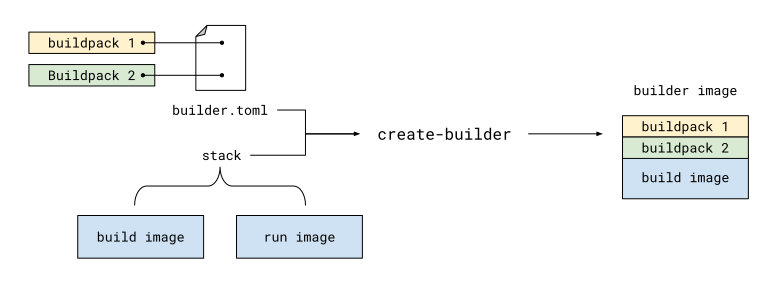

# pack - Buildpack CLI [](https://travis-ci.org/buildpack/pack)

**`pack`** makes it easy for
- **Application developers** to use [Cloud Native Buildpacks](https://buildpacks.io/) to convert code into runnable images
- **Buildpack authors** to develop and package buildpacks for distribution

Ready to embark on your adventure with `pack` but not sure where to start? Try out our tutorial,
[**An App's Brief Journey from Source to Image**](docs/tutorials/app-journey.md).

Otherwise, read the rest of this document for detailed explanations and examples of `pack`'s most important commands.

---

## Contents
- [Building app images using `build`](#building-app-images-using-build)
  - [Example: Building using the default builder image](#example-building-using-the-default-builder-image)
  - [Example: Building using a specified buildpack](#example-building-using-a-specified-buildpack)
  - [Example: Building with user-provided environment variables](#example-building-with-user-provided-environment-variables)
  - [Building explained](#building-explained)
- [Updating app images using `rebase`](#updating-app-images-using-rebase)
  - [Example: Rebasing an app image](#example-rebasing-an-app-image)
  - [Rebasing explained](#rebasing-explained)
- [Working with builders using `create-builder`](#working-with-builders-using-create-builder)
  - [Example: Creating a builder from buildpacks](#example-creating-a-builder-from-buildpacks)
  - [Builders explained](#builders-explained)
  - [Builder configuration](#builder-configuration)
- [Managing stacks](#managing-stacks)
  - [Run image mirrors](#run-image-mirrors)
- [Resources](#resources)
- [Development](#development)

----

## Building app images using `build`

`pack build` enables app developers to create runnable app images from source code using buildpacks.

```bash
$ pack build <image-name>
```

### Example: Building using the default builder image

In the following example, an app image is created from Node.js application source code.

```bash
$ cd path/to/node/app
$ pack build my-app:my-tag
```

In this case, the default [builder](#working-with-builders-using-create-builder) (essentially, an image containing
buildpacks) is used, and an appropriate buildpack is automatically selected from the builder based on the app source code.

> You can change the default builder using the `set-default-builder` command.
>
> Alternately, you can ignore the default and use a specific builder with the `build` command's `--builder` flag.

To publish the produced image to an image registry, include the `--publish` flag:

```bash
$ pack build registry.example.com/my-app:my-tag --publish
```

### Example: Building using a specified buildpack

In the following example, an app image is created from Node.js application source code, using a buildpack chosen by the
user.

```bash
$ cd path/to/node/app
$ pack build my-app:my-tag --buildpack path/to/some/buildpack
```

The `--buildpack` parameter can be
- a path to a directory, or
- the ID of a buildpack located in a builder

> Multiple buildpacks can be specified, in order, by:
> - supplying `--buildpack` multiple times, or
> - supplying a comma-separated list to `--buildpack` (without spaces)

### Example: Building with user-provided environment variables

In the following example, an app image is created from Node.js application source code and the environment 
variable `HELLO` with the value `WORLD` is provided to the buildpacks at build time.

```bash
$ cd path/to/node/app
$ pack build my-app:my-tag --env "HELLO=WORLD"
```

The `--env` parameter must be one of
- `VARIABLE=VALUE`, or
- `VARIABLE`, where the value of `VARIABLE` will be taken from the current environment

> Multiple environment variables can be specified by supplying `--env` multiple times.

Alternatively, environment variables can be provided using the `--env-file` flag.

```bash
$ cd path/to/node/app
$ pack build my-app:my-tag --env-file ./my-env-file
```

The `--env-file` parameter must be a path to a file where each line is one of
- `VARIABLE=VALUE`, or
- `VARIABLE`, where the value of `VARIABLE` will be taken from the current environment

> Multiple environment variables can be specified by supplying variables on each line of the file.
>
> Variables defined using `--env` take precedence over variables defined in `--env-file`.

### Building explained



To create an app image, `build` executes one or more buildpacks against the app's source code.
Each buildpack inspects the source code and provides relevant dependencies. An image is then generated
from the app's source code and these dependencies.

Buildpacks are compatible with one or more [stacks](#managing-stacks). A stack designates a **build image**
and a **run image**. During the build process, a stack's build image becomes the environment in which buildpacks are
executed, and its run image becomes the base for the final app image. For more information on working with stacks, see
the [Managing stacks](#managing-stacks) section.

Buildpacks can be bundled together with a specific stack's build image, resulting in a
[builder](#working-with-builders-using-create-builder) image (note the "er" ending). Builders provide the most
convenient way to distribute buildpacks for a given stack. For more information on working with builders, see the
[Working with builders using `create-builder`](#working-with-builders-using-create-builder) section.

## Updating app images using `rebase`

The `pack rebase` command allows app developers to rapidly update an app image when its stack's run image has changed.
By using image layer rebasing, this command avoids the need to fully rebuild the app.

```bash
$ pack rebase <image-name>
```

### Example: Rebasing an app image

Consider an app image `my-app:my-tag` that was originally built using the default builder. That builder's stack has a
run image called `pack/run`. Running the following will update the base of `my-app:my-tag` with the latest version of
`pack/run`.

```bash
$ pack rebase my-app:my-tag
```

Like [`build`](#building-app-images-using-build), `rebase` has a `--publish` flag that can be
used to publish the updated app image to a registry.

### Rebasing explained



At its core, image rebasing is a simple process. By inspecting an app image, `rebase` can determine whether or not a
newer version of the app's base image exists (either locally or in a registry). If so, `rebase` updates the app image's
layer metadata to reference the newer base image version.

## Working with builders using `create-builder`

`pack create-builder` enables buildpack authors and platform operators to bundle a collection of buildpacks into a
single image for distribution and use with a specified stack.

```bash
$ pack create-builder <image-name> --builder-config <path-to-builder-toml>
```

### Example: Creating a builder from buildpacks

In this example, a builder image is created from buildpacks `org.example.buildpack-1` and `org.example.buildpack-2`.
A [TOML configuration file](#builder-configuration) provides necessary configuration to the command.

```toml
[[buildpacks]]
  id = "org.example.buildpack-1"
  uri = "relative/path/to/buildpack-1"

[[buildpacks]]
  id = "org.example.buildpack-2"
  uri = "https://example.org/buildpacks/buildpack-2.tgz"

[[groups]]
  [[groups.buildpacks]]
    id = "org.example.buildpack-1"
    version = "0.0.1"
  
  [[groups.buildpacks]]
    id = "org.example.buildpack-2"
    version = "0.0.1"

[stack]
  id = "com.example.stack"
  build-image = "example/build"
  run-image = "example/run"
```

Running `create-builder` while supplying this configuration file will produce the builder image.

```bash
$ pack create-builder my-builder:my-tag --builder-config path/to/builder.toml
```

Like [`build`](#building-app-images-using-build), `create-builder` has a `--publish` flag that can be used to publish
the generated builder image to a registry.

The builder can then be used in `build` by running:

```bash
$ pack build my-app:my-tag --builder my-builder:my-tag --buildpack org.example.buildpack-1
```

### Builders explained



A builder is an image containing a collection of buildpacks that will be executed against application source code, in
the order defined by the builder's [configuration file](#builder-configuration). This image's base will be the build
image associated with a given stack.

> A buildpack's primary role is to inspect the source code, determine any
> dependencies that will be required to compile and/or run the app, and provide runtime dependencies as layers in the
> final app image. 
> 
> It's important to note that the buildpacks in a builder are not actually executed until
> [`build`](#building-explained) is run.

#### Lifecycle

A builder also includes a layer with a series of binaries that are executed during [`build`](#building-explained).
These binaries collectively represent the [buildpack lifecycle](https://github.com/buildpack/lifecycle#lifecycle). See
[Builder configuration](#builder-configuration) for more information on configuring the lifecycle for a builder.

### Builder configuration

The [`create-builder`](#working-with-builders-using-create-builder) command requires a TOML configuration file (commonly
referred to as `builder.toml`). This file has a number of fields.

- **`description`** _(string, optional)_
  <br>
  A human-readable description of the builder, to be shown in `inspect-builder` output
  (run `pack inspect-builder -h` for more information).

- **`buildpacks`** _(list, required)_
  <br>
  A list of buildpacks, each with the following fields:
  
  - **`id`** _(string, optional)_
    <br>
    An identifier for the buildpack. Must match ID specified in buildpack's `buildpack.toml` file.
  
  - **`version`** _(string, optional)_
      <br>
      Version of the buildpack. Must match version specified in buildpack's `buildpack.toml` file.
      
  - **`uri`** _(string, required)_
    <br>
    Either a fully-qualified URL to a `.tgz` file, or a path to a local buildpack's `.tgz` file or directory (relative to
    `builder.toml`)
    
  - **`latest`** _(boolean, optional, default: `false`)_
    <br>
    Whether or not this buildpack is considered the latest version (for use in specifying `groups` below).
  
  > Multiple versions of the same buildpack (i.e. buildpacks with the same ID) may be specified in this list, though
  > only one entry per ID may be marked as `latest`.

- **`groups`** _(list, required)_
  <br>
  A list of buildpack groups. This list determines the order in which groups of buildpacks
  will be tested during detection. Detection is a phase of the [lifecycle](#lifecycle) where
  buildpacks are tested, one group at a time, for compatibility with the provided application source code. The first
  group whose non-optional buildpacks all pass detection will be the group selected for the remainder of the build. Each
  group currently contains a single required field:
  
  - **`buildpacks`** _(list, required)_
    <br>
    The set of buildpacks belonging to the group. Each buildpack specified has the following fields (different from the
    buildpack fields mentioned previously):
  
    - **`id`** _(string, required)_
      <br>
      The identifier of a buildpack from the configuration's top-level `buildpacks` list. Buildpacks with the same ID may
      appear in multiple groups at once but never in the same group.
    
    - **`version`** _(string, required)_
      <br>
      The version of the buildpack being referred to. Alternately, specify `"latest"` to use the buildpack marked as
      `latest` in the configuration's top-level `buildpacks` list.
    
    - **`optional`** _(boolean, optional, default: false)_
      <br>
      Whether or not this buildpack is optional during detection.
 
- **`stack`** _(required)_
  <br>
  The stack to use for the builder. See [Managing stacks](#managing-stacks) for more information about this field. It
  contains the following fields:
  
  - **`id`** _(required, string)_
    <br>
    Identifier for the stack
  
  - **`build-image`** _(required, string)_
    <br>
    Build image for the stack
  
  - **`run-image`** _(required, string)_
    <br>
    Run image for the stack
  
  - **`run-image-mirrors`** _(optional, string list)_
    <br>
    [Run image mirrors](#run-image-mirrors) for the stack

- **`lifecycle`** _(optional)_
  <br>
  The [lifecycle](#lifecycle) to use for the builder. It contains the following fields:

  - **`version`** _(string, optional)_
    <br>
    The version of the lifecycle (semver format). If omitted, defaults to the latest release of the lifecycle captured
    at the time of `pack`'s particular release (i.e. if you're pinned to a particular release of `pack`, this default
    will never change, even when new versions of the lifecycle are released).
   
  - **`uri`** _(string, optional)_
    <br>
    Either a fully-qualified URL to a `.tgz` file, or a path to a local lifecycle's `.tgz` file (relative to
    `builder.toml`). If omitted, a URL to a GitHub release for the defined `version` will be used.
  
  > If the `lifecycle` field itself is omitted, default values for each sub-field will be used.

## Managing stacks

As mentioned [previously](#building-explained), a stack is a named association of a build image and a run image.
Stacks are managed through a builder's [configuration file](#builder-configuration):

```toml
[[buildpacks]]
  # ...

[[groups]]
  # ...

[stack]
  id = "com.example.stack"
  build-image = "example/build"
  run-image = "example/run"
  run-image-mirrors = ["gcr.io/example/run", "registry.example.com/example/run"]
```

By providing the required `[stack]` section, a builder author can configure a stack's ID, build image, and run image
(including any mirrors).

### Run image mirrors

Run image mirrors provide alternate locations for run images, for use during `build` (or `rebase`).
When running `build` with a builder containing run image mirrors, `pack` will select a run image
whose registry location matches that of the specified app image (if no registry host is specified in the image name,
DockerHub is assumed). This is useful when publishing the resulting app image (via the `--publish` flag or via
`docker push`), as the app's base image (i.e. run image) will be located on the same registry as the app image itself,
reducing the amount of data transfer required to push the app image.

In the following example, assuming a builder configured with the example TOML above, the selected run image will be
`registry.example.com/example/run`.

```bash
$ pack build registry.example.com/example/app
```

while naming the app without a registry specified, `example/app`, will cause `example/run` to be selected as the app's
run image.

```bash
$ pack build example/app
```

> For local development, it's often helpful to override the run image mirrors in a builder. For this, the
> `set-run-image-mirrors` command can be used. This command does not modify the builder, and instead configures the
> user's local machine.
>
> To see what run images are configured for a builder, the
> `inspect-builder` command can be used. `inspect-builder` will output built-in and locally-configured run images for
> a given builder, among other useful information. The order of the run images in the output denotes the order in
> which they will be matched during `build`.

## Resources

- [Buildpack & Platform Specifications](https://github.com/buildpack/spec)

----

## Development
### Building
To build pack, run:
```
go build ./cmd/pack
```
> This project uses [go modules](https://github.com/golang/go/wiki/Modules)

### Testing
To run unit and integration tests:

```bash
$ go test
```

To run acceptance tests:
```bash
$ go test -tags=acceptance ./acceptance/...
```
