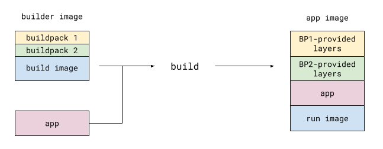
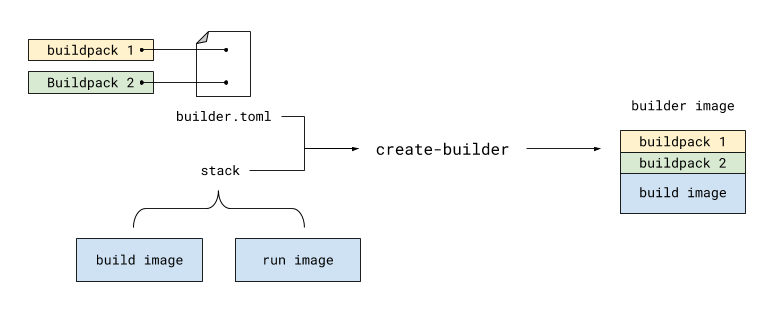

# pack - Buildpack CLI [](https://travis-ci.org/buildpack/pack)

**`pack`** makes it easy for
- **application developers** to use [buildpacks](https://buildpacks.io/) to convert code into runnable images
- **buildpack authors** to develop and package buildpacks for distribution

## Contents
- [Building App Images Using `build`](#building-app-images-using-build)
  - [Example: Building Using the Default Builder Image](#example-building-using-the-default-builder-image)
  - [Example: Building Using a Specified Buildpack](#example-building-using-a-specified-buildpack)
  - [Building Explained](#building-explained)
- [Updating App Images Using `rebase`](#updating-app-images-using-rebase)
  - [Example: Rebasing an App Image](#example-rebasing-an-app-image)
  - [Rebasing Explained](#rebasing-explained)
- [Working with Builders Using `create-builder`](#working-with-builders-using-create-builder)
  - [Example: Creating a Builder from Buildpacks](#example-creating-a-builder-from-buildpacks)
  - [Builders Explained](#builders-explained)
- [Managing Stacks](#managing-stacks)
  - [Example: Adding a Stack](#example-adding-a-stack)
  - [Example: Updating a Stack](#example-updating-a-stack)
  - [Example: Deleting a Stack](#example-deleting-a-stack)
  - [Example: Setting the Default Stack](#example-setting-the-default-stack)
  - [Listing Stacks](#listing-stacks)
- [Resources](#resources)
- [Development](#development)

----

## Building App Images Using `build`

`pack build` enables app developers to create runnable app images from source code using buildpacks.

```
$ pack build <image-name>
```

### Example: Building Using the Default Builder Image

In the following example, an app image is created from Node source code.

```
$ cd /path/to/node/app
$ pack build my-app:my-tag

# ... Detect, analyze and build output

Successfully built 2452b4b1fce1
Successfully tagged my-app:my-tag
```

In this case, the default [builder](#working-with-builders-using-create-builder) is used, and an appropriate buildpack
is automatically selected from the builder based on the app source code. To understand more about what builders are and
how to create or use them, see the
[Working with Builders Using `create-builder`](#working-with-builders-using-create-builder) section.

To publish the produced image to an image registry, include the `--publish` flag (this is most useful
for private registries):

```
$ pack build private-registry.example.com/my-app:my-tag --publish
```

### Example: Building Using a Specified Buildpack

In the following example, an app image is created from Node source code, using a buildpack chosen by the user.

```
$ cd /path/to/node/app
$ pack build my-app:my-tag --buildpack path/to/some/buildpack

# ...
*** DETECTING WITH MANUALLY-PROVIDED GROUP:
2018/10/29 18:31:05 Group: Name Of Some Buildpack: pass
# ...

Successfully built 2452b4b1fce1
Successfully tagged my-app:my-tag
```

The message `DETECTING WITH MANUALLY-PROVIDED GROUP` indicates that the buildpack was chosen by the user, rather than
by the automated detection process.

The `--buildpack` parameter can be
- a path to a directory
- a path to a `.tgz` file
- a URL to a `.tgz` file, or
- the ID of a buildpack located in a builder

### Building Explained



To create an app image, `build` executes one or more buildpacks against the app's source code.
Each buildpack inspects the source code and provides relevant dependencies. An image is then generated
from the app's source code and these dependencies.

Buildpacks are compatible with one or more [stacks](#managing-stacks). A stack designates a **build image**
and a **run image**. During the build process, a stack's build image becomes the environment in which buildpacks are
executed, and its run image becomes the base for the final app image. For more information on working with stacks, see
the [Managing Stacks](#managing-stacks) section.

Buildpacks can be bundled together with a specific stack's build image, resulting in a
[builder](#working-with-builders-using-create-builder) image (note the "er" ending). Builders provide the most
convenient way to distribute buildpacks for a given stack. For more information on working with builders, see the
[Working with Builders Using `create-builder`](#working-with-builders-using-create-builder) section.

## Updating App Images Using `rebase`

The `pack rebase` command allows app developers to rapidly update an app image when its stack's run image has changed.
By using image layer rebasing, this command avoids the need to fully rebuild the app.

```
$ pack rebase <image-name>
```

### Example: Rebasing an App Image

Consider an app image `my-app:my-tag` that was originally built using the default builder. That builder's stack has a
run image called `pack/run`. Running the following will update the base of `my-app:my-tag` with the latest version of
`pack/run`.

```
$ pack rebase my-app:my-tag
```

Like [`build`](#building-app-images-using-build), `rebase` has a `--publish` flag that can be
used to publish the updated app image to a registry.

### Rebasing Explained


At its core, image rebasing is a simple process. By inspecting an app image, `rebase` can determine whether or not a
newer version of the app's base image exists (either locally or in a registry). If so, `rebase` updates the app image's
layer metadata to reference the newer base image version.

## Working with Builders Using `create-builder`

`pack create-builder` enables buildpack authors and platform operators to bundle a collection of buildpacks into a
single image for distribution and use with a specified stack.

```
$ pack create-builder --builder-config <path-to-builder-toml>
```

### Example: Creating a Builder from Buildpacks

In this example, a builder image is created from buildpacks `org.example.buildpack-1` and `org.example.buildpack-2`.
A `builder.toml` file provides necessary configuration to the command.

```toml
[[buildpacks]]
  id = "org.example.buildpack-1"
  uri = "relative/path/to/buildpack-1" # URIs without schemes are read as paths relative to builder.toml

[[buildpacks]]
  id = "org.example.buildpack-2"
  uri = "https://example.org/buildpacks/buildpack-2.tgz"

[[groups]]
  [[groups.buildpacks]]
    id = "org.example.buildpack-1"
    version = "0.0.1"
  
  [[groups.buildpacks]]
    id = "org.example.buildpack-2"
    version = "0.0.1"
```

Running `create-builder` while supplying this configuration file will produce the builder image.

```
$ pack create-builder my-builder:my-tag --builder-config path/to/builder.toml

2018/10/29 15:35:47 Pulling builder base image packs/build
2018/10/29 15:36:06 Successfully created builder image: my-builder:my-tag
```

> The above example uses the default stack, whose build image is `packs/build`.
> The `--stack` parameter can be used to specify a different stack (currently, the only built-in stack is
> `io.buildpacks.stacks.bionic`). For more information about managing stacks and their associations with build and run
> images, see the [Managing Stacks](#managing-stacks) section.

The builder can then be used in [`build`](#building-app-images-using-build) by running:

```
$ pack build my-app:my-tag --builder my-builder:my-tag --buildpack org.example.buildpack-1
```

Like [`build`](#building-app-images-using-build), `create-builder` has a `--publish` flag that can be
used to publish the generated builder image to a registry.

### Builders Explained



A builder is an image containing a collection of buildpacks that will be executed, in the order that they appear in
`builder.toml`, against app source code. A buildpack's primary role is to inspect the source code, determine any
dependencies that will be required to compile and/or run the app, and provide those dependencies as layers in the
resulting image. This image's base will be the build image associated with a given stack.

It's important to note that the buildpacks in a builder are not actually executed until
[`create-builder`](#building-explained) is run.

## Managing Stacks

As mentioned [previously](#building-explained), a stack is associated with a build image and a run image. Stacks in
`pack`'s configuration can be managed using the following commands:

```
$ pack add-stack <stack-name> --build-image <build-image-name> --run-image <run-image-name1,run-image-name2,...>
```

```
$ pack update-stack <stack-name> --build-image <build-image-name> --run-image <run-image-name1,run-image-name2,...>
```

```
$ pack delete-stack <stack-name>
```

```
$ pack set-default-stack <stack-name>
```

> Technically, a stack can be associated with multiple run images, as a variant is needed for each registry to
> which an app image might be published when using `--publish`.

### Example: Adding a Stack

In this example, a new stack called `org.example.my-stack` is added and associated with build image `my-stack/build`
and run image `my-stack/run`.

```
$ pack add-stack org.example.my-stack --build-image my-stack/build --run-image my-stack/run
```

### Example: Updating a Stack

In this example, an existing stack called `org.example.my-stack` is updated with a new build image `my-stack/build:v2`
and a new run image `my-stack/run:v2`.

```
$ pack add-stack org.example.my-stack --build-image my-stack/build:v2 --run-image my-stack/run:v2
```

### Example: Deleting a Stack

In this example, the existing stack `org.example.my-stack` is deleted from `pack`'s configuration.

```
$ pack delete-stack org.example.my-stack
```

### Example: Setting the Default Stack

In this example, the default stack, used by [`create-builder`](#working-with-builders-using-create-builder), is set to
`org.example.my-stack`.

```
$ pack set-default-stack org.example.my-stack
```

### Listing Stacks

To inspect available stacks an their names (denoted by `id`), run:

```
$ cat ~/.pack/config.toml

...

[[stacks]]
  id = "io.buildpacks.stacks.bionic"
  build-images = ["packs/build"]
  run-images = ["packs/run"]

[[stacks]]
  id = "org.example.my-stack"
  build-images = ["my-stack/build"]
  run-images = ["my-stack/run"]

...
```

> Note that this method of inspecting available stacks will soon be replaced by a new command. The format of
> `config.toml` is subject to change at any time.

## Resources

- [Buildpack & Platform Specifications](https://github.com/buildpack/spec)

----

## Development

To run the tests, simply run:

```
$ go test
```